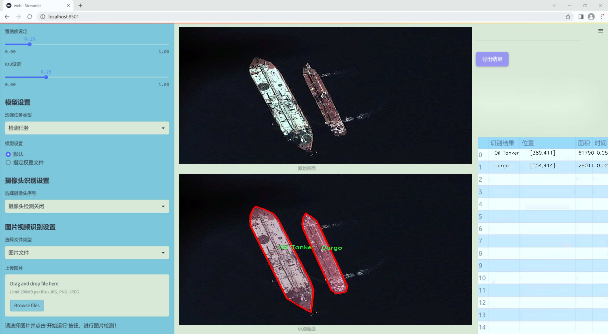
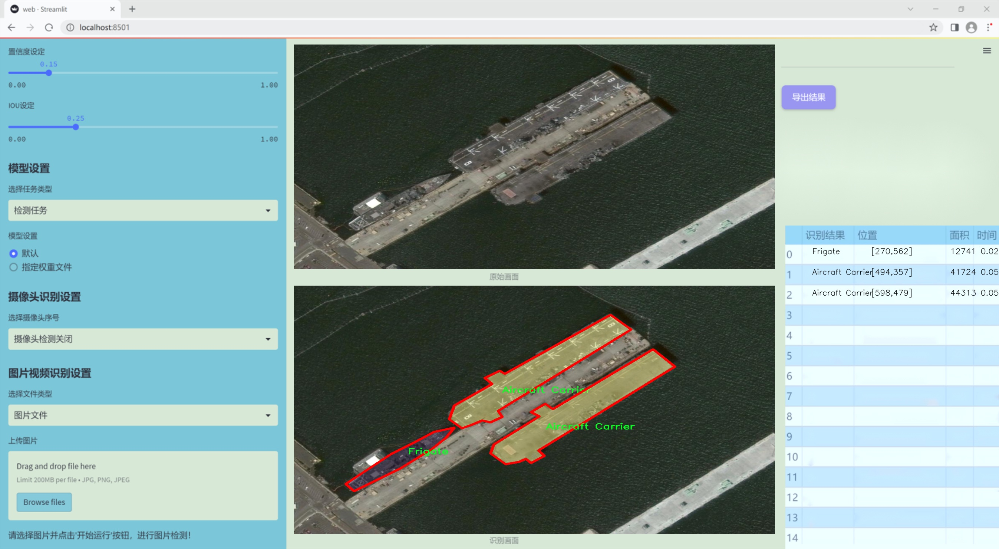
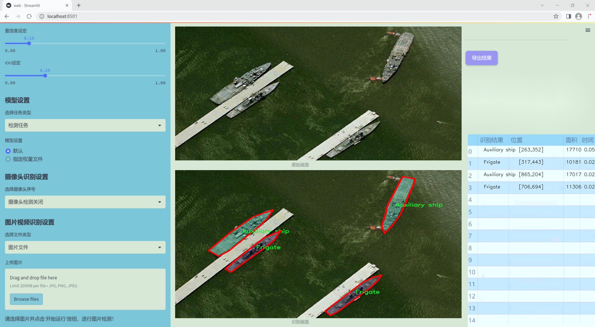
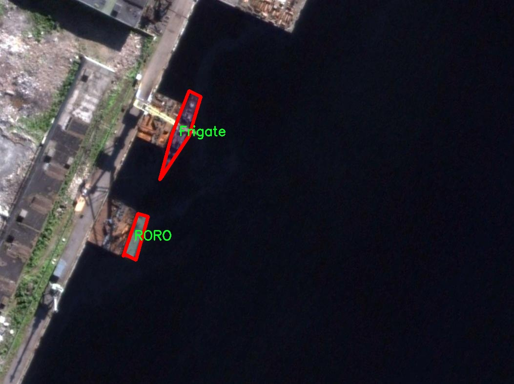
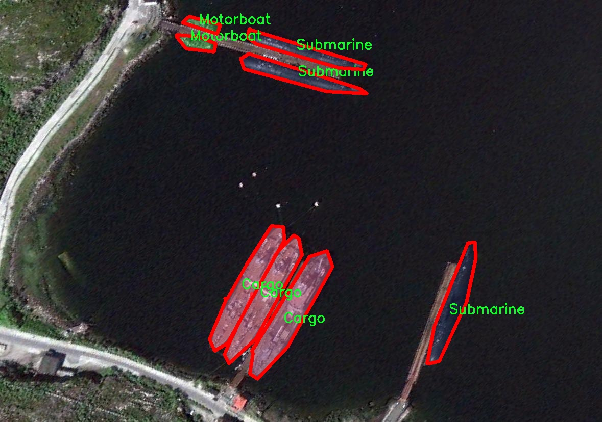
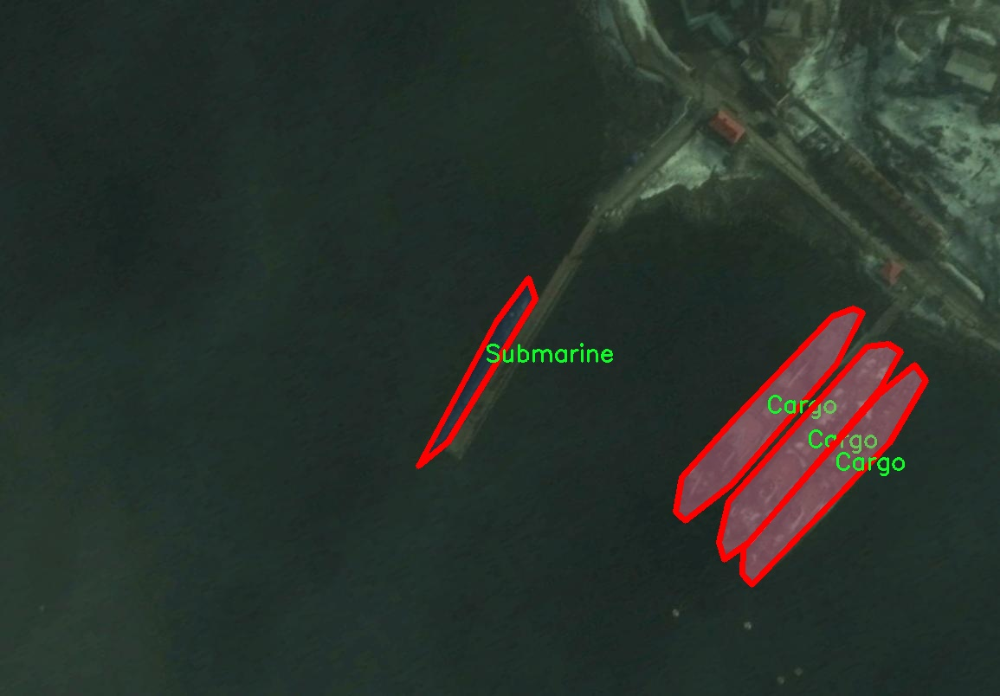
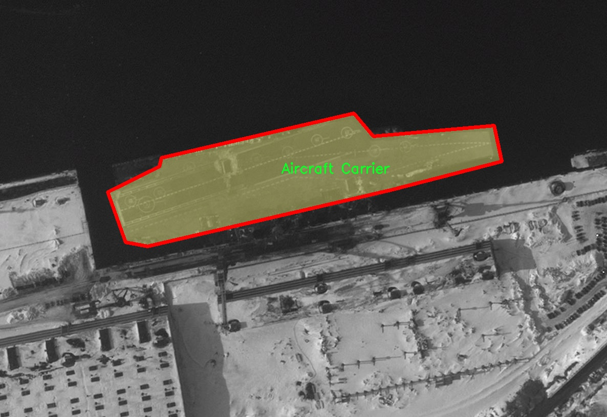
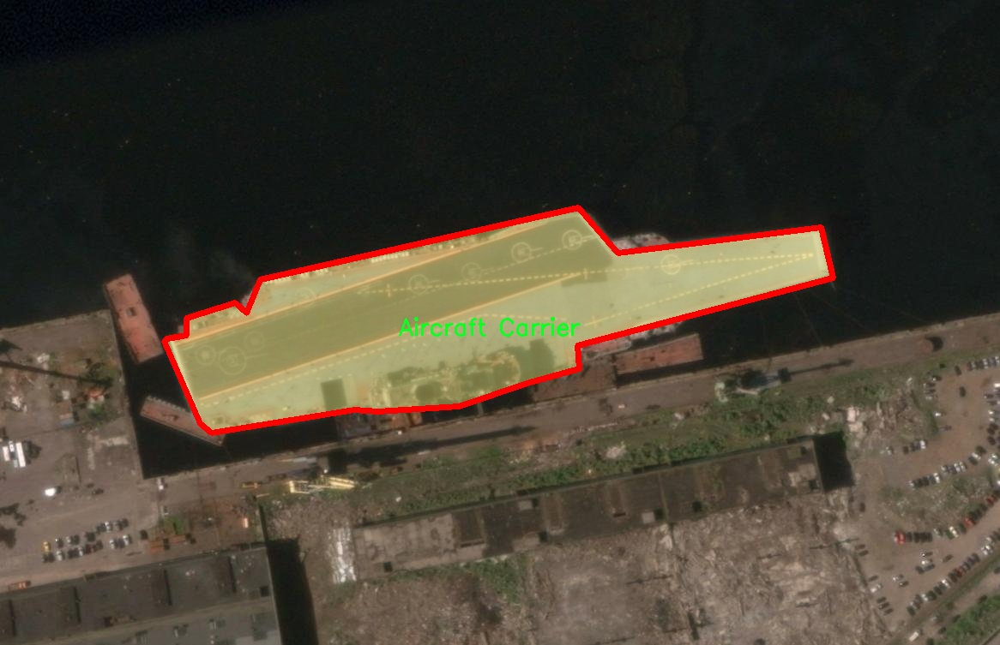

# 改进yolo11-ContextGuided等200+全套创新点大全：舰船战舰检测与分类图像分割系统源码＆数据集全套

### 1.图片效果展示







##### 项目来源 **[人工智能促进会 2024.10.30](https://kdocs.cn/l/cszuIiCKVNis)**

注意：由于项目一直在更新迭代，上面“1.图片效果展示”和“2.视频效果展示”展示的系统图片或者视频可能为老版本，新版本在老版本的基础上升级如下：（实际效果以升级的新版本为准）

  （1）适配了YOLOV11的“目标检测”模型和“实例分割”模型，通过加载相应的权重（.pt）文件即可自适应加载模型。

  （2）支持“图片识别”、“视频识别”、“摄像头实时识别”三种识别模式。

  （3）支持“图片识别”、“视频识别”、“摄像头实时识别”三种识别结果保存导出，解决手动导出（容易卡顿出现爆内存）存在的问题，识别完自动保存结果并导出到tempDir中。

  （4）支持Web前端系统中的标题、背景图等自定义修改。

  另外本项目提供训练的数据集和训练教程,暂不提供权重文件（best.pt）,需要您按照教程进行训练后实现图片演示和Web前端界面演示的效果。

### 2.视频效果展示

[2.1 视频效果展示](https://www.bilibili.com/video/BV1m6SEYwEgT/)

### 3.背景

研究背景与意义

随着全球海洋经济的快速发展，海洋安全和海上防御的需求日益增加，舰船检测与分类技术在军事和民用领域的重要性愈发凸显。传统的舰船识别方法多依赖于人工监测和经验判断，效率低下且容易受到人为因素的影响。因此，基于计算机视觉和深度学习的自动化舰船检测与分类系统应运而生，成为提升海洋监控能力的重要手段。

在众多深度学习模型中，YOLO（You Only Look Once）系列因其实时性和高效性受到广泛关注。YOLOv11作为该系列的最新版本，具备更强的特征提取能力和更快的处理速度，适合用于复杂海洋环境下的舰船检测。然而，针对舰船的特定需求，YOLOv11的性能仍有提升空间，尤其是在图像分割和细粒度分类方面。因此，改进YOLOv11以适应舰船战舰的检测与分类任务，具有重要的理论价值和实际意义。

本研究将基于HRSC2016数据集，该数据集包含616幅高分辨率舰船图像，涵盖了多种舰船类型，如航空母舰、驱逐舰、潜艇等。通过对这些图像进行实例分割，能够实现对舰船的精确定位和分类，从而为海洋监控、军事侦察及海上安全提供有力支持。此外，改进后的YOLOv11模型将有助于提升在复杂背景下的检测精度，推动舰船检测技术的进一步发展。

综上所述，基于改进YOLOv11的舰船战舰检测与分类图像分割系统的研究，不仅能提高舰船识别的自动化水平，还能为海洋安全和军事防御提供更为可靠的技术保障，具有广泛的应用前景和深远的社会意义。

### 4.数据集信息展示

##### 4.1 本项目数据集详细数据（类别数＆类别名）

nc: 22
names: ['Aircraft Carrier', 'Auxiliary ship', 'Barge', 'Battleship', 'Bulker Ship', 'Cargo', 'Commander', 'Corvette', 'Cruiser', 'Destroyer', 'Ferry', 'Fishing Vessel', 'Frigate', 'Hospital Ship', 'Landing', 'Motorboat', 'Oil Tanker', 'Partrol', 'RORO', 'Submarine', 'Warship', 'Yatch']


该项目为【图像分割】数据集，请在【训练教程和Web端加载模型教程（第三步）】这一步的时候按照【图像分割】部分的教程来训练

##### 4.2 本项目数据集信息介绍

本项目数据集信息介绍

本项目所使用的数据集为“HRSC2016”，该数据集专门用于舰船战舰的检测与分类，旨在提升YOLOv11模型在图像分割任务中的性能。HRSC2016数据集包含22个不同类别的舰船类型，涵盖了从航空母舰到游艇等多种舰船，具体类别包括：航空母舰、辅助船、驳船、战列舰、散货船、货船、指挥舰、护卫舰、巡洋舰、驱逐舰、渡轮、渔船、护卫舰、医院船、登陆舰、摩托艇、油轮、巡逻舰、滚装船、潜艇、战舰以及游艇。这些类别的多样性使得数据集在舰船检测与分类的研究中具有重要的参考价值。

HRSC2016数据集的图像均为高分辨率，提供了丰富的舰船特征信息，能够有效支持模型的训练与验证。每个类别的舰船在数据集中均有充分的样本，确保了模型在不同类型舰船上的泛化能力。通过对这些图像进行标注，数据集不仅提供了舰船的位置信息，还包含了相应的类别标签，为模型的训练提供了坚实的基础。

在本项目中，HRSC2016数据集将作为核心训练数据，帮助改进YOLOv11的舰船检测与分类图像分割系统。通过对数据集的深入分析与处理，我们期望能够提高模型在复杂海洋环境中的检测精度和分类准确性，从而推动舰船监测技术的发展。整体而言，HRSC2016数据集的丰富性和多样性为本项目的成功实施奠定了重要基础。











### 5.全套项目环境部署视频教程（零基础手把手教学）

[5.1 所需软件PyCharm和Anaconda安装教程（第一步）](https://www.bilibili.com/video/BV1BoC1YCEKi/?spm_id_from=333.999.0.0&vd_source=bc9aec86d164b67a7004b996143742dc)


[5.2 安装Python虚拟环境创建和依赖库安装视频教程（第二步）](https://www.bilibili.com/video/BV1ZoC1YCEBw?spm_id_from=333.788.videopod.sections&vd_source=bc9aec86d164b67a7004b996143742dc)

### 6.改进YOLOv11训练教程和Web_UI前端加载模型教程（零基础手把手教学）

[6.1 改进YOLOv11训练教程和Web_UI前端加载模型教程（第三步）](https://www.bilibili.com/video/BV1BoC1YCEhR?spm_id_from=333.788.videopod.sections&vd_source=bc9aec86d164b67a7004b996143742dc)


按照上面的训练视频教程链接加载项目提供的数据集，运行train.py即可开始训练



     Epoch   gpu_mem       box       obj       cls    labels  img_size
     1/200     20.8G   0.01576   0.01955  0.007536        22      1280: 100%|██████████| 849/849 [14:42<00:00,  1.04s/it]
               Class     Images     Labels          P          R     mAP@.5 mAP@.5:.95: 100%|██████████| 213/213 [01:14<00:00,  2.87it/s]
                 all       3395      17314      0.994      0.957      0.0957      0.0843

     Epoch   gpu_mem       box       obj       cls    labels  img_size
     2/200     20.8G   0.01578   0.01923  0.007006        22      1280: 100%|██████████| 849/849 [14:44<00:00,  1.04s/it]
               Class     Images     Labels          P          R     mAP@.5 mAP@.5:.95: 100%|██████████| 213/213 [01:12<00:00,  2.95it/s]
                 all       3395      17314      0.996      0.956      0.0957      0.0845

     Epoch   gpu_mem       box       obj       cls    labels  img_size
     3/200     20.8G   0.01561    0.0191  0.006895        27      1280: 100%|██████████| 849/849 [10:56<00:00,  1.29it/s]
               Class     Images     Labels          P          R     mAP@.5 mAP@.5:.95: 100%|███████   | 187/213 [00:52<00:00,  4.04it/s]
                 all       3395      17314      0.996      0.957      0.0957      0.0845


###### [项目数据集下载链接](https://kdocs.cn/l/cszuIiCKVNis)

### 7.原始YOLOv11算法讲解


其实到了YOLOV11 基本创新点就不太多了，主要就是大家互相排列组合复用不同的网络模块、损失函数和样本匹配策略，需要注意YOLO V5、V8 V11
都是1个公司的，其余的个人建议看看V8的，剩下的了解就好。

V11支持多种视觉任务：物体检测、实例分割、图像分类、姿态估计和定向物体检测（OBB）。

##### YOLOv11
基本和YOLOV8同源，甚至git目前都是1个，部分代码注释还是YOLOV8的，所以建议先看我写的YOLOV8相关博客，对比YOLOV8主要涉及到：

*backbone 中的使用C2f模块 变为 c3k2 模块。

*backbone 中的最后一层（sppf层）后增加了C2PSA模块。

*head 解耦头中的分类检测头两个Conv 变为 DWConv。

整体技术而言：

*backbone 使用了C2K2模块+最后SPPF模块级联C2PSA模块；

*neck 使用PAN结构，并且里面也使用C3K2模块；

*head使用了anchor-free + Decoupled-head，其中回归头使用正常的卷积，分类头使用DWConv；

*损失函数使用了分类BCE、回归CIOU + VFL的组合；

*框匹配策略由静态匹配改为了Task-Aligned Assigner匹配方式；

*训练策略没有提及，其中YOLOV8可以参考如下最后 10 个 epoch 关闭 Mosaic 的操作、训练总 epoch 数从 300 提升到了 500。

##### 主要思路


配置文件：[ultralytics/ultralytics/cfg/models/11/yolo11.yaml at main ·
ultralytics/ultralytics ·
GitHub](https://github.com/ultralytics/ultralytics/blob/main/ultralytics/cfg/models/11/yolo11.yaml
"ultralytics/ultralytics/cfg/models/11/yolo11.yaml at main ·
ultralytics/ultralytics · GitHub")

解析函数：[ultralytics/ultralytics/nn/tasks.py at main · ultralytics/ultralytics ·
GitHub](https://github.com/ultralytics/ultralytics/blob/main/ultralytics/nn/tasks.py#L934
"ultralytics/ultralytics/nn/tasks.py at main · ultralytics/ultralytics ·
GitHub")


##### 具体细节

##### input

输入要求以及预处理，可选项比较多，可以参考这个配置文件：[ultralytics/ultralytics/cfg/default.yaml at main
· ultralytics/ultralytics ·
GitHub](https://github.com/ultralytics/ultralytics/blob/main/ultralytics/cfg/default.yaml
"ultralytics/ultralytics/cfg/default.yaml at main · ultralytics/ultralytics ·
GitHub") 的Hyperparameters 部分。

基础输入仍然为640*640。预处理就是熟悉的letterbox（根据参数配置可以为不同的缩放填充模式，主要用于resize到640）+
转换rgb、chw、int8(0-255)->float（0-1），注意没有归一化操作。需要注意的是作者实现的mosaic和网上看到的不同，对比如下图（左边网上版本，右边是YOLO的实现）。并且作者添加了在最后10轮关闭mosaic增强（YOLOV8开始支持，具体原因个人的经验如我的这篇文章：yolov5
mosaic相关，关闭参数在 Train settings 部分的close_mosaic 选项）


##### backbone

主干网络以及改进

这里不去特意强调对比YOLOv5、V8等等的改进，因为各个系列都在疯狂演进，个人认为没必要花费时间看差异，着重看看一些比较重要的模块即可。源代码：

大多数模块：[ultralytics/ultralytics/nn/modules/block.py at main ·
ultralytics/ultralytics ·
GitHub](https://github.com/ultralytics/ultralytics/blob/main/ultralytics/nn/modules/block.py
"ultralytics/ultralytics/nn/modules/block.py at main · ultralytics/ultralytics
· GitHub")

head 部分：[ultralytics/ultralytics/nn/modules/head.py at main ·
ultralytics/ultralytics ·
GitHub](https://github.com/ultralytics/ultralytics/blob/main/ultralytics/nn/modules/head.py
"ultralytics/ultralytics/nn/modules/head.py at main · ultralytics/ultralytics
· GitHub")

串联模块构造网络：[ultralytics/ultralytics/nn/tasks.py at main ·
ultralytics/ultralytics ·
GitHub](https://github.com/ultralytics/ultralytics/blob/main/ultralytics/nn/tasks.py
"ultralytics/ultralytics/nn/tasks.py at main · ultralytics/ultralytics ·
GitHub")

##### 1）CBS 模块（后面叫做Conv）

就是pytorch 自带的conv + BN +SiLU，这里对应上面的配置文件的Conv 的 args 比如[64, 3, 2] 就是 conv2d
的c2=64、k=3、 s =2、c1 自动为上一层参数、p 为自动计算，真实需要计算scales 里面的with 和 max_channels 缩放系数。

这里连续使用两个3*3卷积stride为2的CBS模块直接横竖各降低了4倍分辨率（整体变为原来1/16）。这个还是比较猛的，敢在如此小的感受野下连续两次仅仅用一层卷积就下采样,当然作为代价它的特征图还是比较厚的分别为16、32。


    
    
        class Conv(nn.Module):
        """Standard convolution with args(ch_in, ch_out, kernel, stride, padding, groups, dilation, activation)."""
    
        default_act = nn.SiLU()  # default activation
    
        def __init__(self, c1, c2, k=1, s=1, p=None, g=1, d=1, act=True):
            """Initialize Conv layer with given arguments including activation."""
            super().__init__()
            self.conv = nn.Conv2d(c1, c2, k, s, autopad(k, p, d), groups=g, dilation=d, bias=False)
            self.bn = nn.BatchNorm2d(c2)
            self.act = self.default_act if act is True else act if isinstance(act, nn.Module) else nn.Identity()
    
        def forward(self, x):
            """Apply convolution, batch normalization and activation to input tensor."""
            return self.act(self.bn(self.conv(x)))
    
        def forward_fuse(self, x):
            """Perform transposed convolution of 2D data."""
            return self.act(self.conv(x))

##### 2）c3k2 模块

##### Bottleneck

有两种结构，需要参数shortcut和两个conv的宽度是否相同来控制。

##### C3 & C3K

都是CSP bottleneck module with 3 convolutions, C3 代表3个卷积层，
K代表其中bottleneck中的卷积核为支持自定义，其实这里c3k作者使用的默认的3*3卷积核也就等同于使用c3(c3是3*3卷积核)。

##### c2f & c3k2

其实也就是仿照YOLOv7 的ELAN
结构，通过更多的分支夸层链接，丰富了模型的梯度流。C3K2模块其实就是C2F模块转变出来的，它代码中有一个设置，就是当c3k这个参数为FALSE的时候，C3K2模块就是C2F模块，也就是说它的Bottleneck是普通的Bottleneck；反之当它为true的时候，将Bottleneck模块替换成C3K模块。模块中存在
Split 等操作对特定硬件部署没有之前那么友好了。需要针对自己的硬件进行测试看对最终推理速度的影响。

可视化关系如下，这里需要注意配置文件中的参数，比如21行[-1, 2, C3k2, [512, False, 0.25]]
512代表宽度、false代表是否使用shortcut、0.25代表c2f的宽度缩放。也就是第一个Conv的输出宽度。


源代码如下:

    
    
    class Bottleneck(nn.Module):
        """Standard bottleneck."""
    
        def __init__(self, c1, c2, shortcut=True, g=1, k=(3, 3), e=0.5):
            """Initializes a standard bottleneck module with optional shortcut connection and configurable parameters."""
            super().__init__()
            c_ = int(c2 * e)  # hidden channels
            self.cv1 = Conv(c1, c_, k[0], 1)
            self.cv2 = Conv(c_, c2, k[1], 1, g=g)
            self.add = shortcut and c1 == c2
    
        def forward(self, x):
            """Applies the YOLO FPN to input data."""
            return x + self.cv2(self.cv1(x)) if self.add else self.cv2(self.cv1(x))
    
    class C3(nn.Module):
        """CSP Bottleneck with 3 convolutions."""
    
        def __init__(self, c1, c2, n=1, shortcut=True, g=1, e=0.5):
            """Initialize the CSP Bottleneck with given channels, number, shortcut, groups, and expansion values."""
            super().__init__()
            c_ = int(c2 * e)  # hidden channels
            self.cv1 = Conv(c1, c_, 1, 1)
            self.cv2 = Conv(c1, c_, 1, 1)
            self.cv3 = Conv(2 * c_, c2, 1)  # optional act=FReLU(c2)
            self.m = nn.Sequential(*(Bottleneck(c_, c_, shortcut, g, k=((1, 1), (3, 3)), e=1.0) for _ in range(n)))
    
        def forward(self, x):
            """Forward pass through the CSP bottleneck with 2 convolutions."""
            return self.cv3(torch.cat((self.m(self.cv1(x)), self.cv2(x)), 1))
    
    class C3k(C3):
        """C3k is a CSP bottleneck module with customizable kernel sizes for feature extraction in neural networks."""
    
        def __init__(self, c1, c2, n=1, shortcut=True, g=1, e=0.5, k=3):
            """Initializes the C3k module with specified channels, number of layers, and configurations."""
            super().__init__(c1, c2, n, shortcut, g, e)
            c_ = int(c2 * e)  # hidden channels
            # self.m = nn.Sequential(*(RepBottleneck(c_, c_, shortcut, g, k=(k, k), e=1.0) for _ in range(n)))
            self.m = nn.Sequential(*(Bottleneck(c_, c_, shortcut, g, k=(k, k), e=1.0) for _ in range(n)))
    
    class C2f(nn.Module):
        """Faster Implementation of CSP Bottleneck with 2 convolutions."""
    
        def __init__(self, c1, c2, n=1, shortcut=False, g=1, e=0.5):
            """Initializes a CSP bottleneck with 2 convolutions and n Bottleneck blocks for faster processing."""
            super().__init__()
            self.c = int(c2 * e)  # hidden channels
            self.cv1 = Conv(c1, 2 * self.c, 1, 1)
            self.cv2 = Conv((2 + n) * self.c, c2, 1)  # optional act=FReLU(c2)
            self.m = nn.ModuleList(Bottleneck(self.c, self.c, shortcut, g, k=((3, 3), (3, 3)), e=1.0) for _ in range(n))
    
        def forward(self, x):
            """Forward pass through C2f layer."""
            y = list(self.cv1(x).chunk(2, 1))
            y.extend(m(y[-1]) for m in self.m)
            return self.cv2(torch.cat(y, 1))
    
        def forward_split(self, x):
            """Forward pass using split() instead of chunk()."""
            y = list(self.cv1(x).split((self.c, self.c), 1))
            y.extend(m(y[-1]) for m in self.m)
            return self.cv2(torch.cat(y, 1))
    
    class C3k2(C2f):
        """Faster Implementation of CSP Bottleneck with 2 convolutions."""
    
        def __init__(self, c1, c2, n=1, c3k=False, e=0.5, g=1, shortcut=True):
            """Initializes the C3k2 module, a faster CSP Bottleneck with 2 convolutions and optional C3k blocks."""
            super().__init__(c1, c2, n, shortcut, g, e)
            self.m = nn.ModuleList(
                C3k(self.c, self.c, 2, shortcut, g) if c3k else Bottleneck(self.c, self.c, shortcut, g) for _ in range(n)
            )

##### 3）sppf 模块

对比spp，将简单的并行max pooling 改为串行+并行的方式。对比如下（左边是SPP，右边是SPPF）：


    
    
        class SPPF(nn.Module):
        # Spatial Pyramid Pooling - Fast (SPPF) layer for YOLOv5 by Glenn Jocher
        def __init__(self, c1, c2, k=5):  # equivalent to SPP(k=(5, 9, 13))
            super().__init__()
            c_ = c1 // 2  # hidden channels
            self.cv1 = Conv(c1, c_, 1, 1)
            self.cv2 = Conv(c_ * 4, c2, 1, 1)
            self.m = nn.MaxPool2d(kernel_size=k, stride=1, padding=k // 2)
    
        def forward(self, x):
            x = self.cv1(x)
            with warnings.catch_warnings():
                warnings.simplefilter('ignore')  # suppress torch 1.9.0 max_pool2d() warning
                y1 = self.m(x)
                y2 = self.m(y1)
                return self.cv2(torch.cat((x, y1, y2, self.m(y2)), 1))

##### 4）C2PSA 模块

C2PSA它结合了PSA(Pointwise Spatial
Attention)块，用于增强特征提取和注意力机制。下面的图建议从左到右看，这样才能更有条理的理解，其实PSA个人感觉就是仿着VIT
的Attention来做的，是把输入C2PSA的特征图的h*w 看做VIT 的path数（也可以理解为NLP中token 个数），特征图的channel
数看做VIT特征维度（CNN的宽度，或者理解为NLP中token
编码后的特征维度），然后计算出QKV（这里需要注意第四幅图的QKV是值，不是操作，所以标注成了圆角矩形，这里是为了大家好理解），这里的Attention其实是在h*w维度计算空间Attention，个人感觉是强制给了全局感受野，并且并联了一个3*3的深度可分离卷积的单空间部分，就是仅在每一个特征图上进行3*3卷积，具体实现是通过pytorch
conv2d 的
group参数设置为特征图的通道数。特别的关于Conv的参数分别为：输入通道数、输出通道数、卷积核尺寸、pad尺寸、group数、是否有激活函数（默认silu）。图中的最后一幅省略了一些细节，可以参考源码。

注意区别C2fPSA，C2fPSA才是对 C2f 模块的扩展，通过在标准 C2f 模块中引入 PSA
块，C2fPSA实现了更强大的注意力机制，从而提高了模型对重要特征的捕捉能力。作者实现了该模块但最终没有使用。


涉及的源码：

    
    
    class Attention(nn.Module):
        """
        Attention module that performs self-attention on the input tensor.
    
        Args:
            dim (int): The input tensor dimension.
            num_heads (int): The number of attention heads.
            attn_ratio (float): The ratio of the attention key dimension to the head dimension.
    
        Attributes:
            num_heads (int): The number of attention heads.
            head_dim (int): The dimension of each attention head.
            key_dim (int): The dimension of the attention key.
            scale (float): The scaling factor for the attention scores.
            qkv (Conv): Convolutional layer for computing the query, key, and value.
            proj (Conv): Convolutional layer for projecting the attended values.
            pe (Conv): Convolutional layer for positional encoding.
        """
    
        def __init__(self, dim, num_heads=8, attn_ratio=0.5):
            """Initializes multi-head attention module with query, key, and value convolutions and positional encoding."""
            super().__init__()
            self.num_heads = num_heads
            self.head_dim = dim // num_heads
            self.key_dim = int(self.head_dim * attn_ratio)
            self.scale = self.key_dim**-0.5
            nh_kd = self.key_dim * num_heads
            h = dim + nh_kd * 2
            self.qkv = Conv(dim, h, 1, act=False)
            self.proj = Conv(dim, dim, 1, act=False)
            self.pe = Conv(dim, dim, 3, 1, g=dim, act=False)
    
        def forward(self, x):
            """
            Forward pass of the Attention module.
    
            Args:
                x (torch.Tensor): The input tensor.
    
            Returns:
                (torch.Tensor): The output tensor after self-attention.
            """
            B, C, H, W = x.shape
            N = H * W
            qkv = self.qkv(x)
            q, k, v = qkv.view(B, self.num_heads, self.key_dim * 2 + self.head_dim, N).split(
                [self.key_dim, self.key_dim, self.head_dim], dim=2
            )
    
            attn = (q.transpose(-2, -1) @ k) * self.scale
            attn = attn.softmax(dim=-1)
            x = (v @ attn.transpose(-2, -1)).view(B, C, H, W) + self.pe(v.reshape(B, C, H, W))
            x = self.proj(x)
            return x
    
    class PSABlock(nn.Module):
        """
        PSABlock class implementing a Position-Sensitive Attention block for neural networks.
    
        This class encapsulates the functionality for applying multi-head attention and feed-forward neural network layers
        with optional shortcut connections.
    
        Attributes:
            attn (Attention): Multi-head attention module.
            ffn (nn.Sequential): Feed-forward neural network module.
            add (bool): Flag indicating whether to add shortcut connections.
    
        Methods:
            forward: Performs a forward pass through the PSABlock, applying attention and feed-forward layers.
    
        Examples:
            Create a PSABlock and perform a forward pass
            >>> psablock = PSABlock(c=128, attn_ratio=0.5, num_heads=4, shortcut=True)
            >>> input_tensor = torch.randn(1, 128, 32, 32)
            >>> output_tensor = psablock(input_tensor)
        """
    
        def __init__(self, c, attn_ratio=0.5, num_heads=4, shortcut=True) -> None:
            """Initializes the PSABlock with attention and feed-forward layers for enhanced feature extraction."""
            super().__init__()
    
            self.attn = Attention(c, attn_ratio=attn_ratio, num_heads=num_heads)
            self.ffn = nn.Sequential(Conv(c, c * 2, 1), Conv(c * 2, c, 1, act=False))
            self.add = shortcut
    
        def forward(self, x):
            """Executes a forward pass through PSABlock, applying attention and feed-forward layers to the input tensor."""
            x = x + self.attn(x) if self.add else self.attn(x)
            x = x + self.ffn(x) if self.add else self.ffn(x)
            return x
        
    class C2PSA(nn.Module):
        """
        C2PSA module with attention mechanism for enhanced feature extraction and processing.
    
        This module implements a convolutional block with attention mechanisms to enhance feature extraction and processing
        capabilities. It includes a series of PSABlock modules for self-attention and feed-forward operations.
    
        Attributes:
            c (int): Number of hidden channels.
            cv1 (Conv): 1x1 convolution layer to reduce the number of input channels to 2*c.
            cv2 (Conv): 1x1 convolution layer to reduce the number of output channels to c.
            m (nn.Sequential): Sequential container of PSABlock modules for attention and feed-forward operations.
    
        Methods:
            forward: Performs a forward pass through the C2PSA module, applying attention and feed-forward operations.
    
        Notes:
            This module essentially is the same as PSA module, but refactored to allow stacking more PSABlock modules.
    
        Examples:
            >>> c2psa = C2PSA(c1=256, c2=256, n=3, e=0.5)
            >>> input_tensor = torch.randn(1, 256, 64, 64)
            >>> output_tensor = c2psa(input_tensor)
        """
    
        def __init__(self, c1, c2, n=1, e=0.5):
            """Initializes the C2PSA module with specified input/output channels, number of layers, and expansion ratio."""
            super().__init__()
            assert c1 == c2
            self.c = int(c1 * e)
            self.cv1 = Conv(c1, 2 * self.c, 1, 1)
            self.cv2 = Conv(2 * self.c, c1, 1)
    
            self.m = nn.Sequential(*(PSABlock(self.c, attn_ratio=0.5, num_heads=self.c // 64) for _ in range(n)))
    
        def forward(self, x):
            """Processes the input tensor 'x' through a series of PSA blocks and returns the transformed tensor."""
            a, b = self.cv1(x).split((self.c, self.c), dim=1)
            b = self.m(b)
            return self.cv2(torch.cat((a, b), 1))

##### 3、neck & head

##### 1）检测头

YOLOV11 Head 部分和YOLOV8是近似的，所以简单对比YOLOV5、V8、V11。


如上面图，上边是YOLOV5 的结构，中是YOLOv8 的结构，下面是YOLOV11 结构

Yolov5: 检测和分类共用一个卷积（coupled head）并且是anchor based ,其 卷积输出为（5+N class）*3，其中
5为bbox 四个值（具体代表什么不同版本略有不同，官方git有说明，历史版本见 目标检测算法——YOLOV5 ）+ 一个obj 值
（是否有目标，这个是从YOLO V1 传承下来的，个人感觉有点绕和不合理，并且后面取消），N class 为类别数，3为anchor 的数量，默认是3个。

YOLOv8：检测和分类的卷积是解耦的（decoupled），如中图，上面一条卷积支路是回归框，框的特征图channel为4*regmax，关于这个regmax
后面我们详细的解释,并不是anchor；分类的channel 为类别数。

YOLOV11：检测和分类的卷积是解耦的（decoupled），如右图，上面一条卷积支路是回归框，框的特征图channel为4*regmax，关于这个regmax
后面我们详细的解释,并不是anchor；分类的channel 为类别数，分类使用深度可分离卷积替代常规卷积降低计算量。

源码部分如下

    
    
    class Detect(nn.Module):
        """YOLO Detect head for detection models."""
    
        dynamic = False  # force grid reconstruction
        export = False  # export mode
        end2end = False  # end2end
        max_det = 300  # max_det
        shape = None
        anchors = torch.empty(0)  # init
        strides = torch.empty(0)  # init
    
        def __init__(self, nc=80, ch=()):
            """Initializes the YOLO detection layer with specified number of classes and channels."""
            super().__init__()
            self.nc = nc  # number of classes
            self.nl = len(ch)  # number of detection layers
            self.reg_max = 16  # DFL channels (ch[0] // 16 to scale 4/8/12/16/20 for n/s/m/l/x)
            self.no = nc + self.reg_max * 4  # number of outputs per anchor
            self.stride = torch.zeros(self.nl)  # strides computed during build
            c2, c3 = max((16, ch[0] // 4, self.reg_max * 4)), max(ch[0], min(self.nc, 100))  # channels
            self.cv2 = nn.ModuleList(
                nn.Sequential(Conv(x, c2, 3), Conv(c2, c2, 3), nn.Conv2d(c2, 4 * self.reg_max, 1)) for x in ch
            )
            self.cv3 = nn.ModuleList(
                nn.Sequential(
                    nn.Sequential(DWConv(x, x, 3), Conv(x, c3, 1)),
                    nn.Sequential(DWConv(c3, c3, 3), Conv(c3, c3, 1)),
                    nn.Conv2d(c3, self.nc, 1),
                )
                for x in ch
            )
            self.dfl = DFL(self.reg_max) if self.reg_max > 1 else nn.Identity()
    
            if self.end2end:
                self.one2one_cv2 = copy.deepcopy(self.cv2)
                self.one2one_cv3 = copy.deepcopy(self.cv3)
    
        def forward(self, x):
            """Concatenates and returns predicted bounding boxes and class probabilities."""
            if self.end2end:
                return self.forward_end2end(x)
    
            for i in range(self.nl):
                x[i] = torch.cat((self.cv2[i](x[i]), self.cv3[i](x[i])), 1)
            if self.training:  # Training path
                return x
            y = self._inference(x)
            return y if self.export else (y, x)

因此主要的变化可以认为有三个：（1）coupled head -> decoupled head ；（2）obj 分支消失；（3）anchor
based——> anchor free ; 4) 深度可分离卷积。

（1）coupled head -> decoupled head

这个解耦操作，看YOLO x 的论文，约有1% 的提升。逻辑和实现都比较直观易懂，不再赘述。

（2）obj 分支消失；

这个其实我自己再看YOLO V1 的时候就有疑问，它存在的意义。后来人们发现，其实obj
的在训练和推理过程中存在逻辑不一致性。具体而言（摘自“<https://zhuanlan.zhihu.com/p/147691786>”）

A。用法不一致。训练的时候，分类和质量估计各自训练自个儿的，但测试的时候却又是乘在一起作为NMS score排序的依据，这个操作显然没有end-to-
end，必然存在一定的gap。（个人认为还好，就是两个监督信号）

B。对象不一致。借助Focal
Loss的力量，分类分支能够使得少量的正样本和大量的负样本一起成功训练，但是质量估计通常就只针对正样本训练。那么，对于one-
stage的检测器而言，在做NMS
score排序的时候，所有的样本都会将分类score和质量预测score相乘用于排序，那么必然会存在一部分分数较低的“负样本”的质量预测是没有在训练过程中有监督信号的，对于大量可能的负样本，他们的质量预测是一个未定义行为。这就很有可能引发这么一个情况：一个分类score相对低的真正的负样本，由于预测了一个不可信的极高的质量score，而导致它可能排到一个真正的正样本（分类score不够高且质量score相对低）的前面。问题一如图所示：


（3）anchor based——> anchor free

这里主要涉及怎么定义回归内容以及如何匹配GT框的问题。也就是如下：

##### 2）匹配策略

A。回归的内容当前版本就是回归的lftp四个值（这四个值是距离匹配到的anchor 点的距离值！不是图片的绝对位置）。后面推理阶段通过
dist2bbox函数转换为需要的格式：

[
https://github.com/ultralytics/ultralytics/blob/cc3c774bde86ffce694d202b7383da6cc1721c1b/ultralytics/nn/modules.py#L378](https://github.com/ultralytics/ultralytics/blob/cc3c774bde86ffce694d202b7383da6cc1721c1b/ultralytics/nn/modules.py#L378
"  
 https://github.com/ultralytics/ultralytics/blob/cc3c774bde86ffce694d202b7383da6cc1721c1b/ultralytics/nn/modules.py#L378")

[
https://github.com/ultralytics/ultralytics/blob/cc3c774bde86ffce694d202b7383da6cc1721c1b/ultralytics/yolo/utils/tal.py#L196](https://github.com/ultralytics/ultralytics/blob/cc3c774bde86ffce694d202b7383da6cc1721c1b/ultralytics/yolo/utils/tal.py#L196
"  
 https://github.com/ultralytics/ultralytics/blob/cc3c774bde86ffce694d202b7383da6cc1721c1b/ultralytics/yolo/utils/tal.py#L196")。

    
    
       def dist2bbox(distance, anchor_points, xywh=True, dim=-1):
        """Transform distance(ltrb) to box(xywh or xyxy)."""
        lt, rb = torch.split(distance, 2, dim)
        x1y1 = anchor_points - lt
        x2y2 = anchor_points + rb
        if xywh:
            c_xy = (x1y1 + x2y2) / 2
            wh = x2y2 - x1y1
            return torch.cat((c_xy, wh), dim)  # xywh bbox
        return torch.cat((x1y1, x2y2), dim)  # xyxy bbox

##### B.匹配策略

YOLOv5 采用静态的匹配策略，V8采用了动态的TaskAlignedAssigner，其余常见的动态匹配还有： YOLOX 的 simOTA、TOOD
的 TaskAlignedAssigner 和 RTMDet 的 DynamicSoftLabelAssigner。


TaskAligned使用分类得分和IoU的高阶组合来衡量Task-Alignment的程度。使用上面公式来对每个实例计算Anchor-level
的对齐程度：s 和 u 分别为分类得分和 IoU 值，α 和 β 为权重超参。t 可以同时控制分类得分和IoU 的优化来实现 Task-
Alignment，可以引导网络动态的关注于高质量的Anchor。采用一种简单的分配规则选择训练样本：对每个实例，选择m个具有最大t值的Anchor作为正样本，选择其余的Anchor作为负样本。然后，通过损失函数(针对分类与定位的对齐而设计的损失函数)进行训练。

代码地址：[ultralytics/ultralytics/yolo/utils/tal.py at
c0c0c138c12699807ff9446f942cb3bd325d670b · ultralytics/ultralytics ·
GitHub](https://github.com/ultralytics/ultralytics/blob/c0c0c138c12699807ff9446f942cb3bd325d670b/ultralytics/yolo/utils/tal.py#L56
"ultralytics/ultralytics/yolo/utils/tal.py at
c0c0c138c12699807ff9446f942cb3bd325d670b · ultralytics/ultralytics · GitHub")

默认参数如下（当前版本这些超参没有提供修改的接口，如需修改需要在源码上进行修改）：


##### 4、loss function

损失函数设计

Loss 计算包括 2 个分支： 分类和回归分支，没有了之前的 objectness 分支。

分类分支依然采用 BCE Loss。回归分支使用了 Distribution Focal Loss（DFL Reg_max默认为16）+ CIoU
Loss。3 个 Loss
采用一定权重比例加权即可（默认如下：<https://github.com/ultralytics/ultralytics/blob/main/ultralytics/yolo/configs/default.yaml#L83>）。


这里重点介绍一下DFL损失。目前被广泛使用的bbox表示可以看作是对bbox方框坐标建模了单一的狄拉克分布。但是在复杂场景中，一些检测对象的边界并非十分明确。如下图左面所示，对于滑板左侧被水花模糊，引起对左边界的预测分布是任意而扁平的，对右边界的预测分布是明确而尖锐的。对于这个问题，有学者提出直接回归一个任意分布来建模边界框，使用softmax实现离散的回归，将狄拉克分布的积分形式推导到一般形式的积分形式来表示边界框。


狄拉克分布可以认为在一个点概率密度为无穷大，其他点概率密度为0，这是一种极端地认为离散的标签时绝对正确的。


因为标签是一个离散的点，如果把标签认为是绝对正确的目标，那么学习出的就是狄拉克分布，概率密度是一条尖锐的竖线。然而真实场景，物体边界并非是十分明确的，因此学习一个宽范围的分布更为合理。我们需要获得的分布虽然不再像狄拉克分布那么极端（只存在标签值），但也应该在标签值附近。因此学者提出Distribution
Focal
Loss损失函数，目的让网络快速聚焦到标签附近的数值，是标签处的概率密度尽量大。思想是使用交叉熵函数，来优化标签y附近左右两个位置的概率，是网络分布聚焦到标签值附近。如下公式。Si
是网络的sigmod 输出（因为真是是多分类，所以是softmax），yi 和 yi+1 是上图的区间顺序，y是label
值。

具体而言，针对我们将DFL的超参数Reg_max 设置为16的情况下：

A。训练阶段：我们以回归left为例：目标的label 转换为ltrb后，y = （ left - 匹配到的anchor 中心点 x 坐标）/
当前的下采样倍数，假设求得3.2。那么i 就应该为3，yi = 3 ,yi+1 = 4。

B。推理阶段：因为没有label，直接将16个格子进行积分（离散变量为求和，也就是期望）结果就是最终的坐标偏移量（再乘以下采样倍数+
匹配到的anchor的对应坐标）


DFL的实现方式其实就是一个卷积：[ultralytics/ultralytics/nn/modules.py at
cc3c774bde86ffce694d202b7383da6cc1721c1b · ultralytics/ultralytics ·
GitHub](https://github.com/ultralytics/ultralytics/blob/cc3c774bde86ffce694d202b7383da6cc1721c1b/ultralytics/nn/modules.py#L67
"ultralytics/ultralytics/nn/modules.py at
cc3c774bde86ffce694d202b7383da6cc1721c1b · ultralytics/ultralytics · GitHub")

NOTE：作者代码中的超参数Reg_max是写死的——16，并且代码内部做了强制截断到16，如果要修改需要修改源码，如果你的输入是640，最大下采样到20*20，那么16是够用的，如果输入没有resize或者超过了640一定要自己设置这个Reg_max参数，否则如果目标尺寸还大，将无法拟合到这个偏移量。
比如1280*1280的图片，目标1280*960，最大下采样32倍，1280/32/2=20 > 16(除以2是因为是一半的偏移量)，超过了dfl
滑板右侧那个图的范围。至于为什么叫focal
loss的变体，有兴趣看一下这个<https://zhuanlan.zhihu.com/p/357415257>和<https://zhuanlan.zhihu.com/p/147691786>就可以，这里不再赘述是因为，如果先看这些，很容易犯晕，反而抓不住DFL
我认为的重点（离散的分布形式）

    
    
        class DFL(nn.Module):
        # Integral module of Distribution Focal Loss (DFL) proposed in Generalized Focal Loss https://ieeexplore.ieee.org/document/9792391
        def __init__(self, c1=16):
            super().__init__()
            self.conv = nn.Conv2d(c1, 1, 1, bias=False).requires_grad_(False)
            x = torch.arange(c1, dtype=torch.float)
            self.conv.weight.data[:] = nn.Parameter(x.view(1, c1, 1, 1))
            self.c1 = c1
    
        def forward(self, x):
            b, c, a = x.shape  # batch, channels, anchors
            return self.conv(x.view(b, 4, self.c1, a).transpose(2, 1).softmax(1)).view(b, 4, a)
            # return self.conv(x.view(b, self.c1, 4, a).softmax(1)).view(b, 4, a)


### 8.200+种全套改进YOLOV11创新点原理讲解

#### 8.1 200+种全套改进YOLOV11创新点原理讲解大全

由于篇幅限制，每个创新点的具体原理讲解就不全部展开，具体见下列网址中的改进模块对应项目的技术原理博客网址【Blog】（创新点均为模块化搭建，原理适配YOLOv5~YOLOv11等各种版本）

[改进模块技术原理博客【Blog】网址链接](https://gitee.com/qunmasj/good)


#### 8.2 精选部分改进YOLOV11创新点原理讲解

###### 这里节选部分改进创新点展开原理讲解(完整的改进原理见上图和[改进模块技术原理博客链接](https://gitee.com/qunmasj/good)【如果此小节的图加载失败可以通过CSDN或者Github搜索该博客的标题访问原始博客，原始博客图片显示正常】

### Gold-YOLO简介
YOLO再升级：华为诺亚提出Gold-YOLO，聚集-分发机制打造新SOTA
在过去的几年中，YOLO系列模型已经成为实时目标检测领域的领先方法。许多研究通过修改架构、增加数据和设计新的损失函数，将基线推向了更高的水平。然而以前的模型仍然存在信息融合问题，尽管特征金字塔网络（FPN）和路径聚合网络（PANet）已经在一定程度上缓解了这个问题。因此，本研究提出了一种先进的聚集和分发机制（GD机制），该机制通过卷积和自注意力操作实现。这种新设计的模型被称为Gold-YOLO，它提升了多尺度特征融合能力，在所有模型尺度上实现了延迟和准确性的理想平衡。此外，本文首次在YOLO系列中实现了MAE风格的预训练，使得YOLO系列模型能够从无监督预训练中受益。Gold-YOLO-N在COCO val2017数据集上实现了出色的39.9% AP，并在T4 GPU上实现了1030 FPS，超过了之前的SOTA模型YOLOv6-3.0-N，其FPS相似，但性能提升了2.4%。


#### Gold-YOLO


YOLO系列的中间层结构采用了传统的FPN结构，其中包含多个分支用于多尺度特征融合。然而，它只充分融合来自相邻级别的特征，对于其他层次的信息只能间接地进行“递归”获取。

传统的FPN结构在信息传输过程中存在丢失大量信息的问题。这是因为层之间的信息交互仅限于中间层选择的信息，未被选择的信息在传输过程中被丢弃。这种情况导致某个Level的信息只能充分辅助相邻层，而对其他全局层的帮助较弱。因此，整体上信息融合的有效性可能受到限制。
为了避免在传输过程中丢失信息，本文采用了一种新颖的“聚集和分发”机制（GD），放弃了原始的递归方法。该机制使用一个统一的模块来收集和融合所有Level的信息，并将其分发到不同的Level。通过这种方式，作者不仅避免了传统FPN结构固有的信息丢失问题，还增强了中间层的部分信息融合能力，而且并没有显著增加延迟。


# 8.低阶聚合和分发分支 Low-stage gather-and-distribute branch
从主干网络中选择输出的B2、B3、B4、B5特征进行融合，以获取保留小目标信息的高分辨率特征。


低阶特征对齐模块 (Low-stage feature alignment module)： 在低阶特征对齐模块（Low-FAM）中，采用平均池化（AvgPool）操作对输入特征进行下采样，以实现统一的大小。通过将特征调整为组中最小的特征大小（ R B 4 = 1 / 4 R ） （R_{B4} = 1/4R）（R 
B4 =1/4R），我们得到对齐后的特征F a l i g n F_{align}F align 。低阶特征对齐技术确保了信息的高效聚合，同时通过变换器模块来最小化后续处理的计算复杂性。其中选择 R B 4 R_{B4}R B4 作为特征对齐的目标大小主要基于保留更多的低层信息的同时不会带来较大的计算延迟。
低阶信息融合模块(Low-stage information fusion module)： 低阶信息融合模块（Low-IFM）设计包括多层重新参数化卷积块（RepBlock）和分裂操作。具体而言，RepBlock以F a l i g n ( c h a n n e l = s u m ( C B 2 ， C B 3 ， C B 4 ， C B 5 ) ) F_{align} (channel= sum(C_{B2}，C_{B3}，C_{B4}，C_{B5}))F align (channel=sum(C B2 ，C B3 ，C B4 ，C B5 )作为输入，并生成F f u s e ( c h a n n e l = C B 4 + C B 5 ) F_{fuse} (channel= C_{B4} + C_{B5})F fuse (channel=C B4 +C B5 )。其中中间通道是一个可调整的值（例如256），以适应不同的模型大小。由RepBlock生成的特征随后在通道维度上分裂为F i n j P 3 Finj_P3Finj P 3和F i n j P 4 Finj_P4Finj P 4，然后与不同级别的特征进行融合。


# 8.高阶聚合和分发分支 High-stage gather-and-distribute branch
高级全局特征对齐模块（High-GD）将由低级全局特征对齐模块（Low-GD）生成的特征{P3, P4, P5}进行融合。


高级特征对齐模块(High-stage feature alignment module)： High-FAM由avgpool组成，用于将输入特征的维度减小到统一的尺寸。具体而言，当输入特征的尺寸为{R P 3 R_{P3}R P3 , R P 4 R_{P4}R P4 , R P 5 R_{P 5}R P5 }时，avgpool将特征尺寸减小到该特征组中最小的尺寸（R P 5 R_{P5}R P5  = 1/8R）。由于transformer模块提取了高层次的信息，池化操作有助于信息聚合，同时降低了transformer模块后续步骤的计算需求。

Transformer融合模块由多个堆叠的transformer组成，transformer块的数量为L。每个transformer块包括一个多头注意力块、一个前馈网络（FFN）和残差连接。采用与LeViT相同的设置来配置多头注意力块，使用16个通道作为键K和查询Q的头维度，32个通道作为值V的头维度。为了加速推理过程，将层归一化操作替换为批归一化，并将所有的GELU激活函数替换为ReLU。为了增强变换器块的局部连接，在两个1x1卷积层之间添加了一个深度卷积层。同时，将FFN的扩展因子设置为2，以在速度和计算成本之间取得平衡。

信息注入模块(Information injection module)： 高级全局特征对齐模块（High-GD）中的信息注入模块与低级全局特征对齐模块（Low-GD）中的相同。在高级阶段，局部特征（Flocal）等于Pi，因此公式如下所示：


### 增强的跨层信息流动 Enhanced cross-layer information flow
为了进一步提升性能，从YOLOv11 中的PAFPN模块中得到启发，引入了Inject-LAF模块。该模块是注入模块的增强版，包括了一个轻量级相邻层融合（LAF）模块，该模块被添加到注入模块的输入位置。为了在速度和准确性之间取得平衡，设计了两个LAF模型：LAF低级模型和LAF高级模型，分别用于低级注入（合并相邻两层的特征）和高级注入（合并相邻一层的特征）。它们的结构如图5(b)所示。为了确保来自不同层级的特征图与目标大小对齐，在实现中的两个LAF模型仅使用了三个操作符：双线性插值（上采样过小的特征）、平均池化（下采样过大的特征）和1x1卷积（调整与目标通道不同的特征）。模型中的LAF模块与信息注入模块的结合有效地平衡了准确性和速度之间的关系。通过使用简化的操作，能够增加不同层级之间的信息流路径数量，从而提高性能而不显著增加延迟。


### 9.系统功能展示

图9.1.系统支持检测结果表格显示

  图9.2.系统支持置信度和IOU阈值手动调节

  图9.3.系统支持自定义加载权重文件best.pt(需要你通过步骤5中训练获得)

  图9.4.系统支持摄像头实时识别

  图9.5.系统支持图片识别

  图9.6.系统支持视频识别

  图9.7.系统支持识别结果文件自动保存

  图9.8.系统支持Excel导出检测结果数据


### 10. YOLOv11核心改进源码讲解

#### 10.1 efficientViT.py

以下是对代码中最核心部分的提取和详细中文注释：

```python
import torch
import torch.nn as nn
import torch.nn.functional as F
import itertools
from timm.models.layers import SqueezeExcite

# 定义卷积层和批归一化的组合
class Conv2d_BN(torch.nn.Sequential):
    def __init__(self, in_channels, out_channels, kernel_size=1, stride=1, padding=0, dilation=1, groups=1, bn_weight_init=1):
        super().__init__()
        # 添加卷积层
        self.add_module('c', torch.nn.Conv2d(in_channels, out_channels, kernel_size, stride, padding, dilation, groups, bias=False))
        # 添加批归一化层
        self.add_module('bn', torch.nn.BatchNorm2d(out_channels))
        # 初始化批归一化的权重
        torch.nn.init.constant_(self.bn.weight, bn_weight_init)
        torch.nn.init.constant_(self.bn.bias, 0)

    @torch.no_grad()
    def switch_to_deploy(self):
        # 将训练模式下的卷积和批归一化层转换为推理模式
        c, bn = self._modules.values()
        w = bn.weight / (bn.running_var + bn.eps)**0.5
        w = c.weight * w[:, None, None, None]
        b = bn.bias - bn.running_mean * bn.weight / (bn.running_var + bn.eps)**0.5
        m = torch.nn.Conv2d(w.size(1) * self.c.groups, w.size(0), w.shape[2:], stride=self.c.stride, padding=self.c.padding, dilation=self.c.dilation, groups=self.c.groups)
        m.weight.data.copy_(w)
        m.bias.data.copy_(b)
        return m

# 定义一个块合并的模块
class PatchMerging(torch.nn.Module):
    def __init__(self, dim, out_dim):
        super().__init__()
        hid_dim = int(dim * 4)  # 隐藏层维度
        self.conv1 = Conv2d_BN(dim, hid_dim, 1)  # 第一个卷积层
        self.act = torch.nn.ReLU()  # 激活函数
        self.conv2 = Conv2d_BN(hid_dim, hid_dim, 3, 2, 1, groups=hid_dim)  # 第二个卷积层
        self.se = SqueezeExcite(hid_dim, .25)  # Squeeze-and-Excitation模块
        self.conv3 = Conv2d_BN(hid_dim, out_dim, 1)  # 输出卷积层

    def forward(self, x):
        # 前向传播
        x = self.conv3(self.se(self.act(self.conv2(self.act(self.conv1(x))))))
        return x

# 定义前馈网络
class FFN(torch.nn.Module):
    def __init__(self, ed, h):
        super().__init__()
        self.pw1 = Conv2d_BN(ed, h)  # 第一个卷积层
        self.act = torch.nn.ReLU()  # 激活函数
        self.pw2 = Conv2d_BN(h, ed, bn_weight_init=0)  # 输出卷积层

    def forward(self, x):
        # 前向传播
        x = self.pw2(self.act(self.pw1(x)))
        return x

# 定义高效ViT模块
class EfficientViTBlock(torch.nn.Module):
    def __init__(self, ed, kd, nh=8):
        super().__init__()
        self.dw0 = Conv2d_BN(ed, ed, 3, 1, 1, groups=ed)  # 深度卷积
        self.ffn0 = FFN(ed, int(ed * 2))  # 前馈网络
        self.mixer = LocalWindowAttention(ed, kd, nh)  # 局部窗口注意力
        self.dw1 = Conv2d_BN(ed, ed, 3, 1, 1, groups=ed)  # 深度卷积
        self.ffn1 = FFN(ed, int(ed * 2))  # 前馈网络

    def forward(self, x):
        # 前向传播
        return self.ffn1(self.dw1(self.mixer(self.ffn0(self.dw0(x)))))

# 定义高效ViT模型
class EfficientViT(torch.nn.Module):
    def __init__(self, img_size=400, patch_size=16, embed_dim=[64, 128, 192], depth=[1, 2, 3], num_heads=[4, 4, 4]):
        super().__init__()
        self.patch_embed = Conv2d_BN(3, embed_dim[0] // 8, 3, 2, 1)  # 图像嵌入
        self.blocks = nn.ModuleList()  # 存储多个块
        for i in range(len(depth)):
            for _ in range(depth[i]):
                self.blocks.append(EfficientViTBlock(embed_dim[i], embed_dim[i] // num_heads[i], num_heads[i]))

    def forward(self, x):
        x = self.patch_embed(x)  # 嵌入图像
        for block in self.blocks:
            x = block(x)  # 通过每个块
        return x

# 创建高效ViT模型实例
def EfficientViT_M0():
    return EfficientViT(embed_dim=[64, 128, 192], depth=[1, 2, 3], num_heads=[4, 4, 4])

if __name__ == '__main__':
    model = EfficientViT_M0()  # 初始化模型
    inputs = torch.randn((1, 3, 640, 640))  # 创建输入张量
    res = model(inputs)  # 前向传播
    print(res.size())  # 输出结果的尺寸
```

### 代码核心部分说明：
1. **Conv2d_BN**: 该类封装了卷积层和批归一化层，并提供了在推理模式下的转换方法。
2. **PatchMerging**: 该模块用于将输入特征图的通道合并，通过卷积和激活函数进行处理。
3. **FFN**: 前馈网络模块，包含两个卷积层和一个激活函数。
4. **EfficientViTBlock**: 高效ViT的基本构建块，包含深度卷积、前馈网络和局部窗口注意力。
5. **EfficientViT**: 整个模型的定义，包含图像嵌入和多个高效ViT块的堆叠。

这些核心部分构成了高效ViT模型的基础，能够处理图像输入并进行特征提取。

这个文件定义了一个名为`EfficientViT`的深度学习模型架构，主要用于图像处理任务。该模型是基于视觉变换器（Vision Transformer, ViT）的高效版本，旨在通过改进的结构和机制提高性能和效率。

首先，文件导入了必要的库，包括PyTorch和一些自定义的层。`Conv2d_BN`类是一个封装了卷积层和批归一化层的模块，提供了在构造时初始化权重的功能，并且可以在推理阶段切换到部署模式，以提高推理速度。

接下来，`replace_batchnorm`函数用于替换模型中的批归一化层，以提高模型的推理效率。`PatchMerging`类实现了将输入特征图进行合并的操作，以减少特征图的分辨率并增加通道数。

`Residual`类实现了残差连接的机制，允许模型在训练时引入随机丢弃，以增强模型的鲁棒性。`FFN`类实现了前馈神经网络模块，包含两个卷积层和一个激活函数。

`CascadedGroupAttention`和`LocalWindowAttention`类实现了注意力机制的不同变体。前者通过分组注意力来处理输入特征，后者则通过局部窗口注意力来增强模型对局部特征的关注。

`EfficientViTBlock`类是模型的基本构建块，结合了卷积、前馈网络和注意力机制，形成了一个完整的处理单元。`EfficientViT`类则是整个模型的主体，包含多个这样的构建块，并通过不同的参数配置实现了灵活的模型结构。

在模型的初始化过程中，用户可以指定输入图像的大小、补丁大小、冻结的层数、输入通道数、各个阶段的配置等。模型的不同变体（如`EfficientViT_M0`到`EfficientViT_M5`）通过不同的超参数配置来实现。

最后，文件提供了一些函数用于加载预训练模型的权重，并在模型的推理过程中对输入进行处理。`update_weight`函数用于更新模型的权重，确保权重的形状匹配。

在`__main__`部分，示例代码展示了如何实例化`EfficientViT_M0`模型，并对随机生成的输入进行前向传播，输出每个阶段的特征图大小。这为用户提供了一个简单的使用示例，方便理解模型的输入输出结构。

#### 10.2 EfficientFormerV2.py

以下是经过简化和注释的核心代码部分，主要保留了模型的结构和功能：

```python
import torch
import torch.nn as nn
import math
import itertools

class Attention4D(nn.Module):
    """实现4D注意力机制的类"""
    def __init__(self, dim=384, key_dim=32, num_heads=8, attn_ratio=4, resolution=7, act_layer=nn.ReLU, stride=None):
        super().__init__()
        self.num_heads = num_heads  # 注意力头的数量
        self.scale = key_dim ** -0.5  # 缩放因子
        self.key_dim = key_dim  # 键的维度
        self.nh_kd = key_dim * num_heads  # 每个头的键的维度总和

        # 根据stride决定是否进行下采样
        if stride is not None:
            self.resolution = math.ceil(resolution / stride)  # 计算下采样后的分辨率
            self.stride_conv = nn.Sequential(
                nn.Conv2d(dim, dim, kernel_size=3, stride=stride, padding=1, groups=dim),
                nn.BatchNorm2d(dim),
            )
            self.upsample = nn.Upsample(scale_factor=stride, mode='bilinear')  # 上采样
        else:
            self.resolution = resolution
            self.stride_conv = None
            self.upsample = None

        self.N = self.resolution ** 2  # 总的空间位置数
        self.d = int(attn_ratio * key_dim)  # 注意力输出的维度
        self.dh = self.d * num_heads  # 每个头的输出维度总和

        # 定义查询、键、值的卷积层
        self.q = nn.Sequential(nn.Conv2d(dim, self.num_heads * self.key_dim, 1), nn.BatchNorm2d(self.num_heads * self.key_dim))
        self.k = nn.Sequential(nn.Conv2d(dim, self.num_heads * self.key_dim, 1), nn.BatchNorm2d(self.num_heads * self.key_dim))
        self.v = nn.Sequential(nn.Conv2d(dim, self.num_heads * self.d, 1), nn.BatchNorm2d(self.num_heads * self.d))

        # 定义局部值的卷积层
        self.v_local = nn.Sequential(
            nn.Conv2d(self.num_heads * self.d, self.num_heads * self.d, kernel_size=3, stride=1, padding=1, groups=self.num_heads * self.d),
            nn.BatchNorm2d(self.num_heads * self.d),
        )

        # 定义注意力机制中的投影层
        self.proj = nn.Sequential(act_layer(), nn.Conv2d(self.dh, dim, 1), nn.BatchNorm2d(dim))

        # 计算注意力偏置
        points = list(itertools.product(range(self.resolution), range(self.resolution)))
        attention_offsets = {}
        idxs = []
        for p1 in points:
            for p2 in points:
                offset = (abs(p1[0] - p2[0]), abs(p1[1] - p2[1]))
                if offset not in attention_offsets:
                    attention_offsets[offset] = len(attention_offsets)
                idxs.append(attention_offsets[offset])
        self.attention_biases = nn.Parameter(torch.zeros(num_heads, len(attention_offsets)))
        self.register_buffer('attention_bias_idxs', torch.LongTensor(idxs).view(self.N, self.N))

    def forward(self, x):
        """前向传播"""
        B, C, H, W = x.shape  # 获取输入的维度
        if self.stride_conv is not None:
            x = self.stride_conv(x)  # 下采样

        # 计算查询、键、值
        q = self.q(x).flatten(2).reshape(B, self.num_heads, -1, self.N).permute(0, 1, 3, 2)
        k = self.k(x).flatten(2).reshape(B, self.num_heads, -1, self.N).permute(0, 1, 2, 3)
        v = self.v(x)
        v_local = self.v_local(v)
        v = v.flatten(2).reshape(B, self.num_heads, -1, self.N).permute(0, 1, 3, 2)

        # 计算注意力权重
        attn = (q @ k) * self.scale + self.attention_biases[:, self.attention_bias_idxs]
        attn = attn.softmax(dim=-1)  # softmax归一化

        # 计算输出
        x = (attn @ v)
        out = x.transpose(2, 3).reshape(B, self.dh, self.resolution, self.resolution) + v_local
        if self.upsample is not None:
            out = self.upsample(out)

        out = self.proj(out)  # 投影到原始维度
        return out


class EfficientFormerV2(nn.Module):
    """EfficientFormer V2模型"""
    def __init__(self, layers, embed_dims=None, num_classes=1000):
        super().__init__()
        self.patch_embed = nn.Conv2d(3, embed_dims[0], kernel_size=3, stride=2, padding=1)  # 初始嵌入层

        # 构建网络结构
        self.network = nn.ModuleList()
        for i in range(len(layers)):
            # 添加每个阶段的块
            stage = nn.Sequential(*[Attention4D(dim=embed_dims[i]) for _ in range(layers[i])])
            self.network.append(stage)

        self.classifier = nn.Linear(embed_dims[-1], num_classes)  # 分类器

    def forward(self, x):
        """前向传播"""
        x = self.patch_embed(x)  # 嵌入
        for block in self.network:
            x = block(x)  # 通过网络块
        x = x.mean(dim=[2, 3])  # 全局平均池化
        x = self.classifier(x)  # 分类
        return x


# 示例用法
if __name__ == '__main__':
    inputs = torch.randn((1, 3, 640, 640))  # 输入张量
    model = EfficientFormerV2(layers=[2, 2, 6, 4], embed_dims=[32, 64, 128, 256])  # 创建模型
    res = model(inputs)  # 前向传播
    print(res.size())  # 输出结果的尺寸
```

### 代码注释说明：
1. **Attention4D类**：实现了一个4D注意力机制，包含查询、键、值的计算，以及注意力权重的计算和应用。
2. **EfficientFormerV2类**：构建了EfficientFormer V2模型，包含多个注意力块和分类器。
3. **前向传播**：定义了模型的前向传播过程，包括输入嵌入、通过网络块处理、全局平均池化和最终分类。
4. **示例用法**：在主程序中创建了一个输入张量并通过模型进行前向传播，输出结果的尺寸。

这个程序文件定义了一个名为 `EfficientFormerV2` 的深度学习模型，主要用于图像处理任务。模型的设计灵感来源于 Transformer 架构，结合了卷积神经网络（CNN）的优点，旨在提高计算效率和准确性。

首先，文件中定义了一些超参数，包括不同模型版本的宽度和深度，这些参数用于控制模型的复杂性和计算需求。具体来说，`EfficientFormer_width` 和 `EfficientFormer_depth` 字典分别定义了不同版本（如 S0、S1、S2 和 L）的通道数和层数。

接下来，定义了多个类，主要包括 `Attention4D`、`Attention4DDownsample`、`Embedding`、`Mlp`、`AttnFFN` 和 `FFN`。这些类实现了模型的核心组件，如注意力机制、前馈网络和嵌入层。

`Attention4D` 类实现了一个四维注意力机制，能够处理输入的特征图，并计算出加权后的输出。它使用了多个卷积层来生成查询（Q）、键（K）和值（V），并通过计算注意力权重来聚合信息。`Attention4DDownsample` 类则在注意力机制的基础上实现了下采样功能，以减少特征图的分辨率。

`Embedding` 类负责将输入图像转换为嵌入表示，支持不同的处理方式（如轻量级和自适应下采样）。`Mlp` 类实现了多层感知机（MLP），用于对特征进行进一步处理。`AttnFFN` 和 `FFN` 类则结合了注意力机制和前馈网络，形成了模型的基本构建块。

`eformer_block` 函数用于构建模型的不同层次结构，具体取决于输入的层数和其他超参数。`EfficientFormerV2` 类则是整个模型的主类，负责整合各个组件，并定义前向传播过程。

在模型的前向传播中，输入图像首先通过嵌入层，然后依次经过各个构建块，最终输出特征。模型还支持特征分支输出，以便在不同层次上获取特征。

文件的最后部分定义了一些函数，用于创建不同版本的 `EfficientFormerV2` 模型，并加载预训练权重。通过 `efficientformerv2_s0`、`efficientformerv2_s1`、`efficientformerv2_s2` 和 `efficientformerv2_l` 函数，可以方便地实例化不同规模的模型。

在 `__main__` 部分，程序创建了几个模型实例，并对随机生成的输入进行前向传播，输出每个模型的特征图大小。这部分代码用于测试模型的构建和功能。

总体而言，这个程序文件实现了一个高效的图像处理模型，结合了注意力机制和卷积操作，适用于各种计算机视觉任务。

#### 10.3 block.py

以下是代码中最核心的部分，并附上详细的中文注释：

```python
import torch
import torch.nn as nn
import torch.nn.functional as F

def autopad(k, p=None, d=1):  # kernel, padding, dilation
    """自动填充以实现'same'形状输出。"""
    if d > 1:
        k = d * (k - 1) + 1 if isinstance(k, int) else [d * (x - 1) + 1 for x in k]  # 实际的卷积核大小
    if p is None:
        p = k // 2 if isinstance(k, int) else [x // 2 for x in k]  # 自动填充
    return p

class Conv(nn.Module):
    """标准卷积层，包含卷积和批归一化。"""
    def __init__(self, in_channels, out_channels, kernel_size=3, stride=1, padding=None, groups=1, act=True):
        super().__init__()
        self.conv = nn.Conv2d(in_channels, out_channels, kernel_size, stride, autopad(kernel_size, padding), groups=groups, bias=False)
        self.bn = nn.BatchNorm2d(out_channels)
        self.act = nn.SiLU() if act else nn.Identity()  # 默认激活函数为SiLU

    def forward(self, x):
        """前向传播函数。"""
        return self.act(self.bn(self.conv(x)))

class Bottleneck(nn.Module):
    """标准瓶颈结构，包含两个卷积层。"""
    def __init__(self, c1, c2, shortcut=True, g=1, k=(3, 3), e=0.5):
        super().__init__()
        c_ = int(c2 * e)  # 隐藏通道数
        self.cv1 = Conv(c1, c_, k[0], 1)  # 第一个卷积层
        self.cv2 = Conv(c_, c2, k[1], 1)  # 第二个卷积层
        self.add = shortcut and c1 == c2  # 是否使用快捷连接

    def forward(self, x):
        """前向传播函数。"""
        return x + self.cv2(self.cv1(x)) if self.add else self.cv2(self.cv1(x))

class C3k(nn.Module):
    """C3k模块，包含多个瓶颈结构。"""
    def __init__(self, c1, c2, n=1, shortcut=False, g=1, e=0.5, k=3):
        super().__init__()
        self.m = nn.Sequential(*(Bottleneck(c1, c2, shortcut, g, k=(k, k), e=1.0) for _ in range(n)))  # 多个瓶颈层

    def forward(self, x):
        """前向传播函数。"""
        return self.m(x)

class DynamicConv(nn.Module):
    """动态卷积层，使用条件卷积。"""
    def __init__(self, c1, c2, k=1, s=1, p=None, g=1, d=1, act=True, num_experts=4):
        super().__init__()
        self.conv = nn.Sequential(
            DynamicConv_Single(c1, c2, kernel_size=k, stride=s, padding=autopad(k, p, d), dilation=d, groups=g, num_experts=num_experts),
            nn.BatchNorm2d(c2),
            nn.SiLU() if act else nn.Identity()
        )

    def forward(self, x):
        """前向传播函数。"""
        return self.conv(x)

class SEAttention(nn.Module):
    """通道注意力机制。"""
    def __init__(self, in_channels, reduction=16):
        super(SEAttention, self).__init__()
        self.fc1 = nn.Conv2d(in_channels, in_channels // reduction, kernel_size=1)
        self.fc2 = nn.Conv2d(in_channels // reduction, in_channels, kernel_size=1)

    def forward(self, x):
        """前向传播函数。"""
        b, c, _, _ = x.size()
        y = F.adaptive_avg_pool2d(x, 1).view(b, c)
        y = self.fc2(F.relu(self.fc1(y))).view(b, c, 1, 1)
        return x * torch.sigmoid(y)

class C3k2(nn.Module):
    """C3k2模块，包含多个C3k模块。"""
    def __init__(self, c1, c2, n=1, c3k=False, e=0.5, g=1, shortcut=True):
        super().__init__()
        self.m = nn.ModuleList(C3k(c1, c2, n, shortcut, g, e) for _ in range(n))  # 多个C3k模块

    def forward(self, x):
        """前向传播函数。"""
        for m in self.m:
            x = m(x)
        return x

# 这里可以继续添加其他类和函数的核心部分及其注释
```

### 代码核心部分说明
1. **autopad**: 用于自动计算卷积的填充，使得输出尺寸与输入相同。
2. **Conv**: 自定义卷积层，包含卷积、批归一化和激活函数。
3. **Bottleneck**: 实现标准的瓶颈结构，通常用于深度学习模型中以减少参数数量。
4. **C3k**: 包含多个瓶颈结构的模块。
5. **DynamicConv**: 实现动态卷积，允许根据输入条件选择卷积核。
6. **SEAttention**: 实现通道注意力机制，增强特征表达能力。
7. **C3k2**: 包含多个C3k模块的结构，适用于更复杂的特征提取。

### 进一步的说明
如果需要对其他部分进行简化和注释，请告知我。

这个程序文件 `block.py` 是一个深度学习模型的实现，主要用于计算机视觉任务，特别是目标检测和图像分割等。文件中包含了多个模块和类，主要涉及卷积操作、注意力机制、特征融合等。以下是对文件内容的详细说明：

首先，文件导入了许多必要的库，包括 PyTorch 和一些自定义模块。接着，定义了一些基础的卷积和激活函数，例如 `Conv` 和 `h_swish`，这些函数在后续的模型构建中被广泛使用。

接下来，文件定义了一系列的网络模块，包括不同类型的卷积块（如 `Bottleneck`、`C3k`、`C3k2` 等），这些模块通过堆叠实现了更复杂的网络结构。每个模块通常包括多个卷积层、激活函数和批归一化层，部分模块还包含了跳跃连接（shortcut），以便在训练过程中保持信息的流动。

文件中还实现了多种注意力机制，如 `GOLDYOLO_Attention`、`PSA_Attention` 和 `CA_HSFPN`，这些机制通过对特征图的加权来增强模型对重要特征的关注，从而提高模型的性能。

此外，文件中实现了一些特征融合模块，如 `DynamicInterpolationFusion` 和 `ContextGuideFusionModule`，这些模块通过对不同尺度的特征进行融合，来增强模型对多尺度信息的捕捉能力。

文件还包含了一些特殊的卷积模块，如 `DynamicConv` 和 `GhostModule`，这些模块通过动态卷积和轻量级卷积的方式，进一步提高了模型的效率和效果。

最后，文件中定义了一些特定的网络结构，如 `C3k2_Star`、`C3k2_MogaBlock` 和 `C3k2_UniRepLKNetBlock`，这些结构结合了上述的各种模块和机制，形成了完整的网络架构。

总的来说，`block.py` 文件是一个功能丰富的深度学习模型实现，涵盖了卷积、注意力、特征融合等多个方面，适用于计算机视觉中的多种任务。通过这些模块的组合，可以构建出高效且具有强大表现力的视觉模型。

#### 10.4 attention.py

以下是代码中最核心的部分，并附上详细的中文注释：

```python
import torch
from torch import nn

class EMA(nn.Module):
    def __init__(self, channels, factor=8):
        super(EMA, self).__init__()
        self.groups = factor  # 将通道分成若干组
        assert channels // self.groups > 0  # 确保每组至少有一个通道
        self.softmax = nn.Softmax(-1)  # 定义softmax层
        self.agp = nn.AdaptiveAvgPool2d((1, 1))  # 自适应平均池化到1x1
        self.pool_h = nn.AdaptiveAvgPool2d((None, 1))  # 自适应平均池化到(h, 1)
        self.pool_w = nn.AdaptiveAvgPool2d((1, None))  # 自适应平均池化到(1, w)
        self.gn = nn.GroupNorm(channels // self.groups, channels // self.groups)  # 分组归一化
        self.conv1x1 = nn.Conv2d(channels // self.groups, channels // self.groups, kernel_size=1)  # 1x1卷积
        self.conv3x3 = nn.Conv2d(channels // self.groups, channels // self.groups, kernel_size=3, padding=1)  # 3x3卷积

    def forward(self, x):
        b, c, h, w = x.size()  # 获取输入的批量大小、通道数、高度和宽度
        group_x = x.reshape(b * self.groups, -1, h, w)  # 将输入重塑为(b*g, c//g, h, w)
        x_h = self.pool_h(group_x)  # 对每组进行高度池化
        x_w = self.pool_w(group_x).permute(0, 1, 3, 2)  # 对每组进行宽度池化并转置
        hw = self.conv1x1(torch.cat([x_h, x_w], dim=2))  # 将两个池化结果拼接后通过1x1卷积
        x_h, x_w = torch.split(hw, [h, w], dim=2)  # 将结果分为高度和宽度部分
        x1 = self.gn(group_x * x_h.sigmoid() * x_w.permute(0, 1, 3, 2).sigmoid())  # 通过sigmoid激活后进行分组归一化
        x2 = self.conv3x3(group_x)  # 通过3x3卷积
        x11 = self.softmax(self.agp(x1).reshape(b * self.groups, -1, 1).permute(0, 2, 1))  # 对x1进行自适应平均池化和softmax
        x12 = x2.reshape(b * self.groups, c // self.groups, -1)  # 重塑x2
        x21 = self.softmax(self.agp(x2).reshape(b * self.groups, -1, 1).permute(0, 2, 1))  # 对x2进行自适应平均池化和softmax
        x22 = x1.reshape(b * self.groups, c // self.groups, -1)  # 重塑x1
        weights = (torch.matmul(x11, x12) + torch.matmul(x21, x22)).reshape(b * self.groups, 1, h, w)  # 计算权重
        return (group_x * weights.sigmoid()).reshape(b, c, h, w)  # 返回加权后的结果

class SimAM(nn.Module):
    def __init__(self, e_lambda=1e-4):
        super(SimAM, self).__init__()
        self.activaton = nn.Sigmoid()  # 定义sigmoid激活函数
        self.e_lambda = e_lambda  # 正则化参数

    def forward(self, x):
        b, c, h, w = x.size()  # 获取输入的批量大小、通道数、高度和宽度
        n = w * h - 1  # 计算n
        x_minus_mu_square = (x - x.mean(dim=[2, 3], keepdim=True)).pow(2)  # 计算均值平方差
        y = x_minus_mu_square / (4 * (x_minus_mu_square.sum(dim=[2, 3], keepdim=True) / n + self.e_lambda)) + 0.5  # 计算y
        return x * self.activaton(y)  # 返回加权后的输入

class SpatialGroupEnhance(nn.Module):
    def __init__(self, groups=8):
        super().__init__()
        self.groups = groups  # 组数
        self.avg_pool = nn.AdaptiveAvgPool2d(1)  # 自适应平均池化到1x1
        self.weight = nn.Parameter(torch.zeros(1, groups, 1, 1))  # 权重参数
        self.bias = nn.Parameter(torch.zeros(1, groups, 1, 1))  # 偏置参数
        self.sig = nn.Sigmoid()  # 定义sigmoid激活函数
        self.init_weights()  # 初始化权重

    def init_weights(self):
        for m in self.modules():
            if isinstance(m, nn.Conv2d):
                nn.init.kaiming_normal_(m.weight, mode='fan_out')  # 使用He初始化卷积层权重
                if m.bias is not None:
                    nn.init.constant_(m.bias, 0)  # 偏置初始化为0
            elif isinstance(m, nn.BatchNorm2d):
                nn.init.constant_(m.weight, 1)  # 批归一化权重初始化为1
                nn.init.constant_(m.bias, 0)  # 偏置初始化为0
            elif isinstance(m, nn.Linear):
                nn.init.normal_(m.weight, std=0.001)  # 线性层权重初始化为小的正态分布
                if m.bias is not None:
                    nn.init.constant_(m.bias, 0)  # 偏置初始化为0

    def forward(self, x):
        b, c, h, w = x.shape  # 获取输入的批量大小、通道数、高度和宽度
        x = x.view(b * self.groups, -1, h, w)  # 重塑输入
        xn = x * self.avg_pool(x)  # 计算加权
        xn = xn.sum(dim=1, keepdim=True)  # 按通道求和
        t = xn.view(b * self.groups, -1)  # 重塑
        t = t - t.mean(dim=1, keepdim=True)  # 减去均值
        std = t.std(dim=1, keepdim=True) + 1e-5  # 计算标准差
        t = t / std  # 归一化
        t = t.view(b, self.groups, h, w)  # 重塑
        t = t * self.weight + self.bias  # 计算最终权重
        t = t.view(b * self.groups, 1, h, w)  # 重塑
        x = x * self.sig(t)  # 加权输入
        x = x.view(b, c, h, w)  # 恢复原始形状
        return x
```

### 代码核心部分说明
1. **EMA (Exponential Moving Average)**: 该模块用于计算输入特征的加权平均，增强特征的表达能力。它通过对输入特征进行分组处理，并使用卷积和归一化操作来实现。

2. **SimAM (Similarity Attention Module)**: 该模块通过计算输入特征的均值和方差来生成注意力权重，并使用sigmoid激活函数来增强特征的表示能力。

3. **SpatialGroupEnhance**: 该模块通过自适应平均池化和sigmoid激活函数来增强空间特征的表达能力。它将输入特征分为多个组，并计算每组的加权平均。

这些模块在特征提取和增强中起着重要作用，能够提高模型的性能。

这个程序文件 `attention.py` 实现了一系列与注意力机制相关的深度学习模块，主要用于计算机视觉任务中的特征提取和增强。文件中使用了 PyTorch 框架，包含了多个类和函数，具体功能如下：

首先，文件导入了必要的库，包括 PyTorch 的核心模块、神经网络模块、以及一些用于高效计算的工具，如 `einops` 和 `torchvision`。接着，定义了一些通用的注意力机制模块，如 `EMA`（Exponential Moving Average）、`SimAM`（Similarity Attention Module）、`SpatialGroupEnhance` 等。

`EMA` 类实现了一种基于通道的注意力机制，通过对输入特征进行分组处理，计算出每个组的权重，并通过 Sigmoid 函数进行激活，最终将权重应用于输入特征。

`SimAM` 类实现了一种简单的注意力机制，主要通过计算输入特征的均值和方差来生成注意力权重，并与输入特征相乘以增强特征。

`SpatialGroupEnhance` 类则通过对输入特征进行空间上的增强，利用平均池化和 Sigmoid 激活函数生成空间注意力权重，从而提升特征的表达能力。

`TopkRouting` 和 `KVGather` 类实现了基于路由的注意力机制，通过选择最相关的特征进行加权聚合，增强了模型对重要特征的关注。

`BiLevelRoutingAttention` 类实现了一种双层路由注意力机制，结合了全局和局部特征的提取，适用于高分辨率输入。该类的 `forward` 方法处理输入特征，通过计算查询、键、值的关系来生成注意力权重，并应用于输入特征。

此外，文件中还实现了其他一些注意力机制模块，如 `CoordAtt`、`TripletAttention`、`BAMBlock`、`EfficientAttention` 等。这些模块各自实现了不同的注意力机制，旨在提升模型的特征提取能力和表达能力。

最后，文件中还定义了一些辅助函数和类，如 `img2windows` 和 `windows2img`，用于处理图像的窗口化操作，以便在注意力计算中进行更细粒度的特征提取。

总体而言，`attention.py` 文件是一个功能丰富的深度学习模块集合，专注于实现各种注意力机制，适用于计算机视觉任务中的特征增强和提取。

注意：由于此博客编辑较早，上面“10.YOLOv11核心改进源码讲解”中部分代码可能会优化升级，仅供参考学习，以“11.完整训练+Web前端界面+200+种全套创新点源码、数据集获取”的内容为准。

### 11.完整训练+Web前端界面+200+种全套创新点源码、数据集获取


# [下载链接：https://mbd.pub/o/bread/Zp6Zk5lu](https://mbd.pub/o/bread/Zp6Zk5lu)